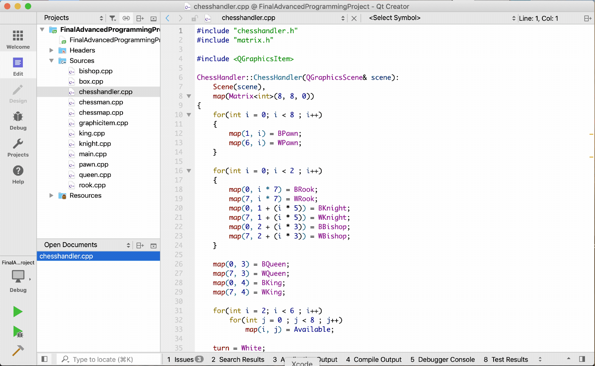

# QT-Chess-Game
Chess is a two-player strategy board game played on a chessboard created with QT technology

This game is my final project in “advanced programming language” course of second
semester of my bachelor degree at Bu-Ali Sina university. This game created by QT
framework with C++ and can be built and ran in all PC platforms include linux and 
windows.

Target platform: Cross platform 
Language: C++
Framework: QT

  Though this game is not complete, it was complete however when it was delivered, when it had been delivered
i lost my hard disk so i lost all of my implementations, recently i found the implementation of
this project in my backups, but it was not complete becuase it is not that version that i delivied as my
project. long story short i decided to complete and publish it on GitHub. maybe it can be helpful to someone.

What do you need to do to complete this game ?
Handle King movements to avoid getting to the conflicts, which is easy task, just run checkmate checker before
king movement with a temporary chessboard and combine the results with current move places. It's that simple!
however i don't have time to work on it more, maybe i will have done it in the future, who knows ?!

Goodluck with that.
